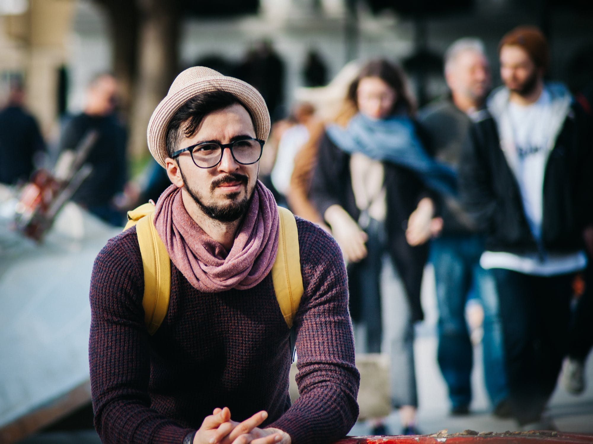
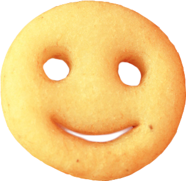
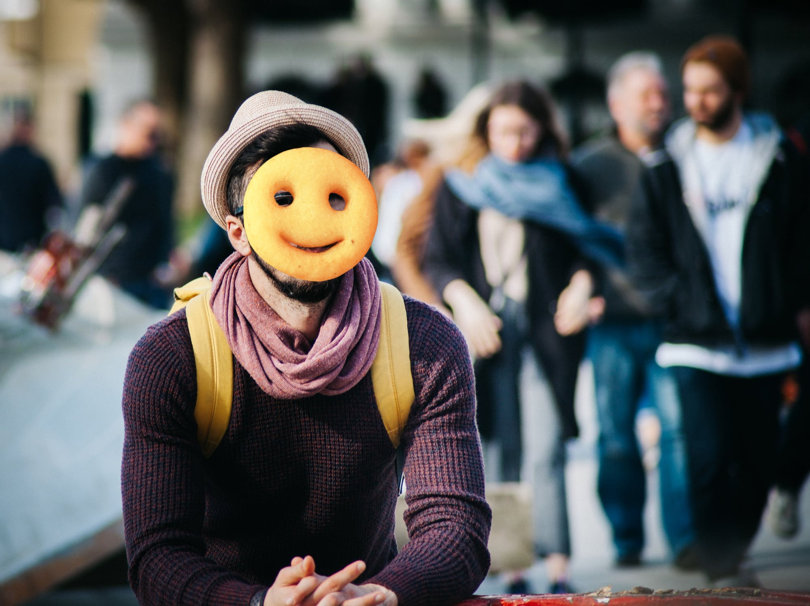

# BeautyPageant

A quick, fun project to automate photoshop and run a virtual beauty pageant for a company Zoom party. It was made over the course of an hour or two with very little quality control, so the results are not too accurate

It can take a folder with images of people and 'photoshop' a filter over their face.

For example, [this image](https://www.pexels.com/photo/man-sitting-next-to-couple-of-person-walking-on-the-street-during-daytime-211050/)



with this waffle face filter



will become (terrifyingly)



Install with

```
$ pip install -r requirements.txt
```

and run the web app with

```
$ python app.py
```

Add your filters to `input/round_{num}.png` and add your input images to `input/round_{num}/` 

Run this to generate the images for round 1 (2 for round 2, 3 for round 3 and so on)

```
$ python photoshop.py 1
```

Each round has a hint/rule that can be changed on ***line  5*** of `app.py`

